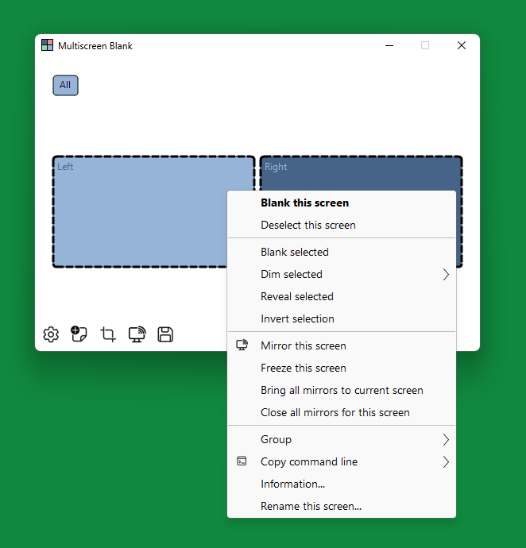

# Multiscreen Blank
Multiscreen Blank is an easy-to-use utility that allows you to independently blank out or dim one or more monitors connected to your computer. Monitors fade in and out with smooth transitions.

This is a personal GitHub mirror for Multiscreen Blank (just in case something happens to the original ;-)

See GitHub Releases section for downloads

Original download url: https://dl.nookkin.com/products/multiscreenblank/

Credit: Lyosha Blinnikov
